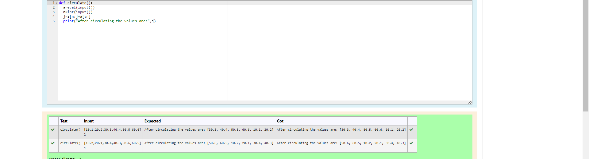

Circulate the values of N variables
## Aim:
To write a python program to circulate the n variables using function concept
## Equipment’s required:
PC
Anaconda - Python 3.7
## Algorithm: 
## Step 1:
Git the list of values from thr user.
## Step 2:
Get the values from the user for thr number of rotation
## Step 3:
Declare a function starting with a keyword"def"
## Step 4:
within the function print the output statement.
## Step 5:
Using the slicing concept rotate the list.
## Step 6:
Display the output. 
Get the value from the user for the number of rotation
### Step 4: 
Using the slicing concept rotate the list
 
## Program:
```
def circulate():
    l=eval(input())
    n=int(input())
    l=l[n:]+l[:n]
    print("After circulating the values are:",l)
```

## Output:


## Result:
The Program is executed Successfully
